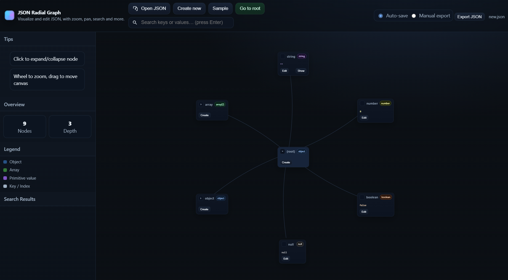

# json-radial-graph
Visualize and edit JSON, with zoom, pan, search and more

### <a href="https://angeldgm.github.io/json-radial-graph/">Go to web app</a>

### Demo

### Support project

### Features
✅ Click on any node and it will become central node (with its children nodes around)

✅ Edit values (with both automatic save or manual export)

✅ Create new entries

✅ Search everywhere (and click result to navigate to it)

✅ Wheel to zoom, drag to move canvas

✅ Open any JSON from disk, paste it create a new one

✅ Modern UI

### Image with latest features added

